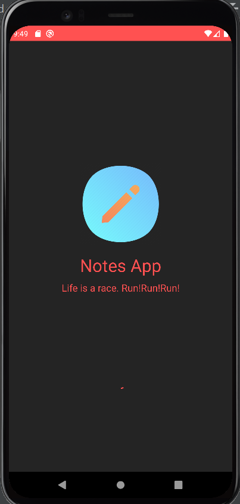
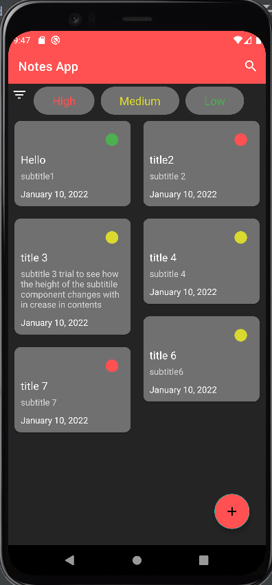
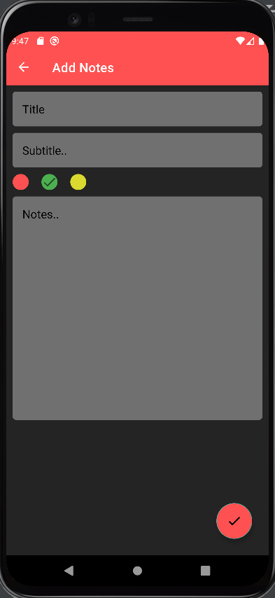
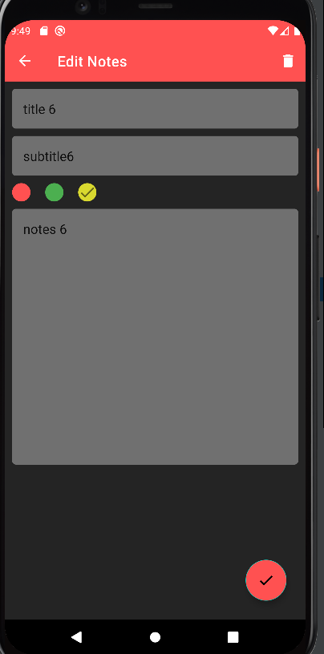
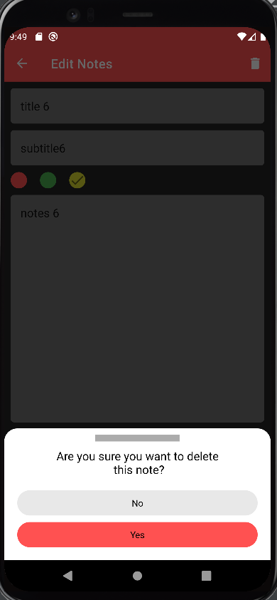
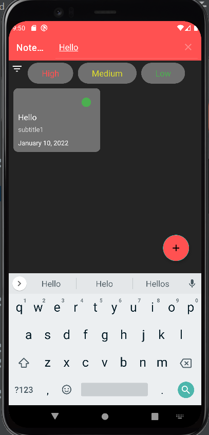
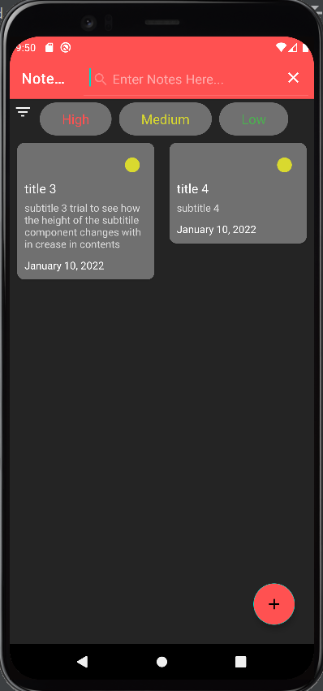

# AndroidStudyJams

### Notes App
#### Problem Statement:

Each and every single one of us forgets some or the other activity we are supposed to do. To prevent this we usually make use of a notepad. But what if we forget to take our notepad with us. An alternate solution will be to use a notes app in our phones which we never miss to take. Thus, we are making use of Kotlin to develop a notes app.

#### Proposed Solution:

This project the Notes App allows users to add, update and delete notes. It also allows users to set the priority of the various tasks. The color red represents a task of least priority whereas a color of green represents a task of high priority. The app allows us to search a particular note as well. It also has an option to filter out the tasks of a particular priority.

#### Functionality and Concepts Used:

The App has a very simple and interactive interface which helps the students select their route bus and track its location. Following are few android concepts used to achieve the functionalities in app :
* Constraint Layout : Most of the activities in the app uses a flexible constraint layout, which is easy to handle for different screen sizes.
* Simple & Easy Views Design : Use of familiar audience EditText with hints and interactive buttons makes it easier for users to add notes without providing any detailed instructions pages. Apps also uses App Navigation to switch between different screens.
* RecyclerView : To present the list of different tasks we have used the efficient recyclerview.
* LiveData & Room Database : We are also using LiveData to update & observe any changes in the notes and update it to local databases using Room. 

#### Application Link & Future Scope :

The link of the app is provided:
Once the app is fully tested and functional it can be uploaded to google play store. It could also be provided with additional functionalities like calender alerts, adding images and other resources etc.
